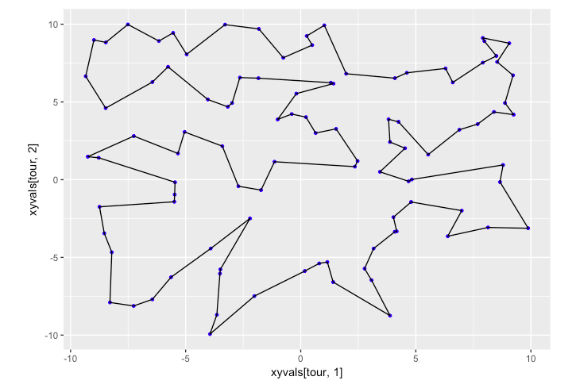
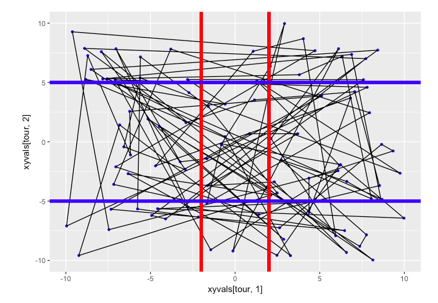
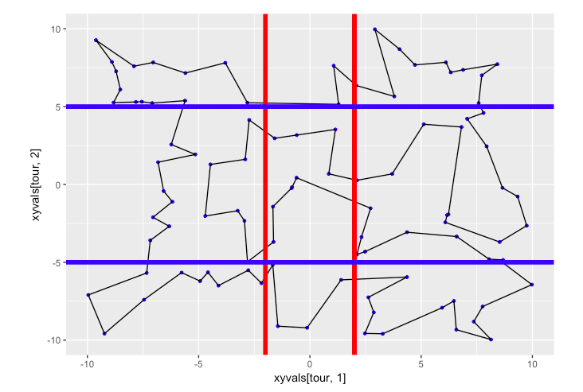
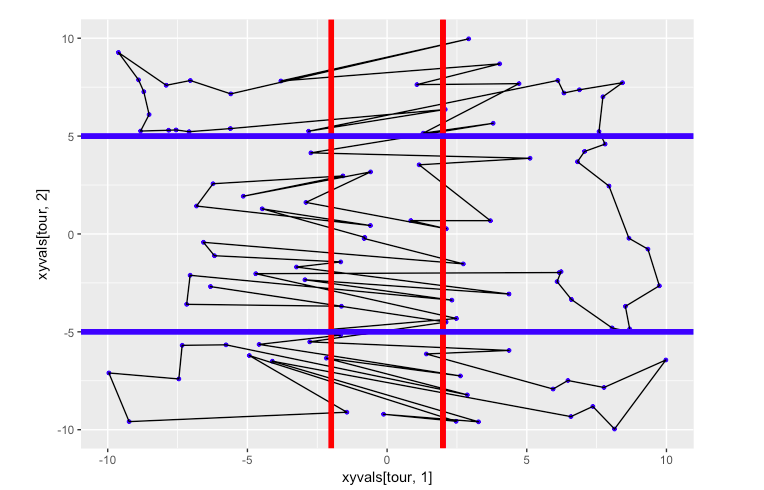
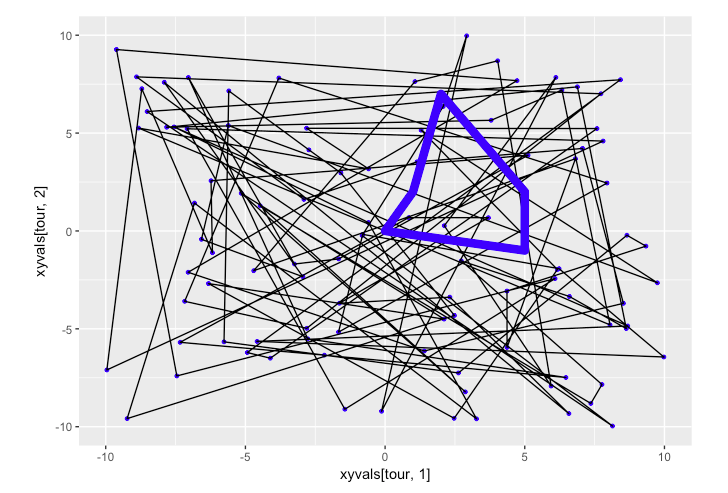

Traveling Salesperson Problem
================

The goal of the Traveling Salesperson Problem (TSP) is to find a tour
which minimizes total distance. We treat distance as our cost and find
the shortest way to reach to each city.

``` r
library(ggplot2)
N<-100#Number of city 
xyvals<-matrix(runif(2*N,-10,10),nrow=N)#imagine the sites 100 cities in the plane

tour<-1:N#each point is visited exactly once and return to the start 

plotTour<-function(tour,ptSize=1){ ggplot(data=NULL,aes(x=xyvals[tour,1],
y=xyvals[tour,2]))+ geom_point(size=ptSize,color="blue")+ geom_polygon(color="black",fill=NA)
}#plotting the tour 

plotTour(tour)
```

<!-- -->

The graph looks quite messy. It seems like there is a better path to
minimize the total distance.

``` r
#Distance function
distPair<-function(i,j,tour){
  x1<-xyvals[tour[i],1]
  y1<-xyvals[tour[i],2]
  x2<-xyvals[tour[j],1]
  y2<-xyvals[tour[j],2]
  dis=sqrt((x2-x1)^2+(y2-y1)^2)
  dis
}

distPair(1,2,tour)
```

    ## [1] 1.830547

``` r
#Distance of total tour function
distTour <-function(tour){
  tot <- 0
  tot1=0
  N<-length(tour)
  i=1
  while(i<N){
    tot=distPair(i,i+1,tour)
    tot1=tot1+tot
    i=i+1
    }
  tot1=tot1+distPair(N,1,tour)
  return(tot1)
  }

distTour(tour)
```

    ## [1] 1058.165

## Normal TSP

We are going to set up the number of city(N=100) and the number of
agents(M=100000) to minimize the distance function. As the number of
city increases, we have to increase the number of agents so that we can
get more accurate picture of shortest path on the graph.

``` r
sig2<-1
M<-100000#number of agents 
decFac<-.9999
dist0<-distTour(tour)

for(m in 1:M){
 
##Randomly Choosing Indexes pos0(less) and pos1(bigger)
sites<-sample(1:N,2,rep=F)
pos1<-max(sites)
pos0<-min(sites)
  
###############Conditions 

##pos0=1 and pos1=N cannot happen(pass)!
if(pos0==1 & pos1==N){
  next
}

###If pos0=1 or pos1==N
if(pos0>1){
  pos0Prev<-pos0-1
  } else{ 
    pos0Prev<-N
    }

if(pos1<N){
  pos1Next<-pos1+1
  } else{
    pos1Next<-1
    }

##Calculating Distance of New Tour
disLost<-distPair(pos0,pos0Prev,tour)+distPair(pos1,pos1Next,tour)
disGained<-distPair(pos0Prev,pos1,tour)+distPair(pos0,pos1Next,tour)
  
deltaDist<-disGained-disLost
dist1<-dist0+deltaDist

##Changing the sequence of tour
tour[pos0:pos1]<-tour[pos1:pos0] 
  
##compute rho
rho<-exp(-deltaDist/sig2)
if(runif(1,0,1)<rho){
    dist0<-dist1  
  } else{
  tour[pos0:pos1]<-tour[pos1:pos0]
  }
##Annealing process
  sig2=sig2*decFac
}

plotTour(tour)
```

<!-- -->

``` r
dist1
```

    ## [1] 171.7718

It looks much neater than before\! The annealing process minimizes the
function so that it finds the shortest total distance(minimum cost).

## A single vertical boarder penalty

I will make a boarder at 0(vertical way) and add the cost of 50 if
agents cross the boarder.

``` r
#refreshing the tour
tour<-1:N

board=0
boarderfee=50

#Distance function
distPair1<-function(i,j,tour){
  x1<-xyvals[tour[i],1]
  y1<-xyvals[tour[i],2]
  x2<-xyvals[tour[j],1]
  y2<-xyvals[tour[j],2]
  dis=sqrt((x2-x1)^2+(y2-y1)^2)
  if(x1<board & x2>board | x2<board & x1>board){
    dis=dis+boarderfee
  }
  dis
}

distPair1(3,2,tour)
```

    ## [1] 5.027426

``` r
#Distance of total tour function
distTour1 <-function(tour){
  tot <- 0
  tot1=0
  N<-length(tour)
  i=1
  while(i<N){
    tot=distPair1(i,i+1,tour)
    tot1=tot1+tot
    i=i+1
    }
  tot1=tot1+distPair1(N,1,tour)
  return(tot1)
  
  }

distTour1(tour)
```

    ## [1] 3458.165

After adding the penalty, the total distance is much bigger than the
total distance from the last section.

## Simulation process(going to use the same condition as the last section)

``` r
xyvals<-matrix(runif(2*N,-10,10),nrow=N)
tour<-1:N
plotTour(tour)
```

<!-- -->

``` r
sig2<-1
M<-100000#number of agents 
decFac<-.9999
dist0<-distTour1(tour)

for(m in 1:M){
 
##Randomly Choosing Indexes pos0(less) and pos1(bigger)
sites<-sample(1:N,2,rep=F)
pos1<-max(sites)
pos0<-min(sites)
  
###############Conditions 

##pos0=1 and pos1=N cannot happen(pass)!
if(pos0==1 & pos1==N){
  next
}

###If pos0=1 or pos1==N
if(pos0>1){
  pos0Prev<-pos0-1
  } else{ 
    pos0Prev<-N
    }

if(pos1<N){
  pos1Next<-pos1+1
  } else{
    pos1Next<-1
    }

##Calculating Distance of New Tour
disLost<-distPair1(pos0,pos0Prev,tour)+distPair1(pos1,pos1Next,tour)
disGained<-distPair1(pos0Prev,pos1,tour)+distPair1(pos0,pos1Next,tour)
  
deltaDist<-disGained-disLost
dist1<-dist0+deltaDist


 
##Changing the sequence of tour
tour[pos0:pos1]<-tour[pos1:pos0] 
  
##compute rho
rho<-exp(-deltaDist/sig2)
if(runif(1,0,1)<rho){
    dist0<-dist1  
  } else{
  tour[pos0:pos1]<-tour[pos1:pos0]
  }
##Annealing process
  sig2=sig2*decFac
}


plotTour(tour)+geom_vline(xintercept = 0,color="red",size=2)
```

<!-- -->

``` r
dist1
```

    ## [1] 261.8921

Once we set the boarder, it crosses the boarder less than a case without
the boarder.

## Bonus boarder

We can think about another case that we will reward agents who cross the
boarder. The boarder is still at 0(vertical way)

``` r
boarderfee=-200

#Distance/cost function
distPair2<-function(i,j,tour){
  x1<-xyvals[tour[i],1]
  y1<-xyvals[tour[i],2]
  x2<-xyvals[tour[j],1]
  y2<-xyvals[tour[j],2]
  dis=sqrt((x2-x1)^2+(y2-y1)^2)
  if(x1<board & x2>board | x2<board & x1>board){
    dis=dis+boarderfee
  }
  dis
}

distPair2(20,2,tour)
```

    ## [1] 5.233729

``` r
#Distance of total tour function
distTour2 <-function(tour){
  tot <- 0
  tot1=0
  N<-length(tour)
  i=1
  while(i<N){
    tot=distPair2(i,i+1,tour)
    tot1=tot1+tot
    i=i+1
    }
  tot1=tot1+distPair2(N,1,tour)
  return(tot1)
  
  }

distTour2(tour)
```

    ## [1] -239.2915

The total distance clearly gets shorter(cost deducted). A negative
number means that we are giving money to agents who cross the boarder.

``` r
tour<-1:N

sig2<-1
M<-10000
decFac<-.9999
dist0<-distTour2(tour)

for(m in 1:M){
 
##Randomly Choosing Indexes pos0(less) and pos1(bigger)
sites<-sample(1:N,2,rep=F)
pos1<-max(sites)
pos0<-min(sites)
  
###############Conditions 

##pos0=1 and pos1=N cannot happen(pass)!
if(pos0==1 & pos1==N){
  next
}

###If pos0=1 or pos1==N
if(pos0>1){
  pos0Prev<-pos0-1
  } else{ 
    pos0Prev<-N
    }

if(pos1<N){
  pos1Next<-pos1+1
  } else{
    pos1Next<-1
    }

##Calculating Distance of New Tour
disLost<-distPair2(pos0,pos0Prev,tour)+distPair2(pos1,pos1Next,tour)
disGained<-distPair2(pos0Prev,pos1,tour)+distPair2(pos0,pos1Next,tour)
deltaDist<-disGained-disLost
dist1<-dist0+deltaDist

 
##Changing the sequence of tour
tour[pos0:pos1]<-tour[pos1:pos0] 
  
##compute rho
rho<-exp(-deltaDist/sig2)
if(runif(1,0,1)<rho){
    dist0<-dist1  
  } else{
  tour[pos0:pos1]<-tour[pos1:pos0]
  }
##Annealing process
  sig2=sig2*decFac
}

plotTour(tour)+geom_vline(xintercept = 0,color="red",size=2)
```

<!-- -->

``` r
dist1
```

    ## [1] -18295.99

The graph clearly shows that everyone wants to cross the boarder for the
reward(money)\!

## Horizontal/vertical border(3x3 of horizontal and vertical boundaries)

``` r
vertical_boarder1=c(2,20)#borader line and cost(only x affected)
vertical_boarder2=c(-2,20)#borader line and cost

horizontal_boarder1=c(5,30)#borader line and cost(only y affected)
horizontal_boarder2=c(-5,30)

distPair3<-function(i,j,tour){
  x1<-xyvals[tour[i],1]
  y1<-xyvals[tour[i],2]
  x2<-xyvals[tour[j],1]
  y2<-xyvals[tour[j],2]
  dis=sqrt((x2-x1)^2+(y2-y1)^2)
  if(x1<vertical_boarder1[1] & x2>vertical_boarder1[1] | x2<vertical_boarder1[1]& x1>vertical_boarder1[1]){
    dis=dis+vertical_boarder1[2]
  }
   if(x1<vertical_boarder2[1] & x2>vertical_boarder2[1] | x2<vertical_boarder2[1]& x1>vertical_boarder2[1]){
    dis=dis+vertical_boarder2[2]
   }
   if(y1<horizontal_boarder1[1] & y2>horizontal_boarder1[1] | y2<horizontal_boarder1[1]& y1>horizontal_boarder1[1]){
    dis=dis+horizontal_boarder1[2]
   }
     if(y1<horizontal_boarder2[1] & y2>horizontal_boarder2[1] | y2<horizontal_boarder2[1]& y1>horizontal_boarder2[1]){
    dis=dis+horizontal_boarder2[2]
  }
  dis
}

distPair3(3,2,tour)
```

    ## [1] 50.13117

``` r
#Distance of total tour function
distTour3 <-function(tour){
  tot <- 0
  tot1=0
  N<-length(tour)
  i=1
  while(i<N){
    tot=distPair3(i,i+1,tour)
    tot1=tot1+tot
    i=i+1
    }
  tot1=tot1+distPair3(N,1,tour)
  return(tot1)
  
  }

distTour3(tour)
```

    ## [1] 4562.669

With the 2 vertical boarders and 2 horizontal boarders, the total
distance gets bigger than the previous cases.

``` r
tour<-1:N
plotTour(tour)+geom_vline(xintercept=vertical_boarder1[1],color="red",size=2)+geom_vline(xintercept=vertical_boarder2[1],color="red",size=2)+geom_hline(yintercept=horizontal_boarder1[1],color="blue",size=2)+geom_hline(yintercept=horizontal_boarder2[1],color="blue",size=2)
```

<!-- -->

``` r
sig2<-1
M<-100000
decFac<-.9999
dist0<-distTour3(tour)

for(m in 1:M){
 
##Randomly Choosing Indexes pos0(less) and pos1(bigger)
sites<-sample(1:N,2,rep=F)
pos1<-max(sites)
pos0<-min(sites)
  
###############Conditions 

##pos0=1 and pos1=N cannot happen(pass)!
if(pos0==1 & pos1==N){
  next
}

###If pos0=1 or pos1==N
if(pos0>1){
  pos0Prev<-pos0-1
  } else{ 
    pos0Prev<-N
    }

if(pos1<N){
  pos1Next<-pos1+1
  } else{
    pos1Next<-1
    }

##Calculating Distance of New Tour
disLost<-distPair3(pos0,pos0Prev,tour)+distPair3(pos1,pos1Next,tour)
disGained<-distPair3(pos0Prev,pos1,tour)+distPair3(pos0,pos1Next,tour)
deltaDist<-disGained-disLost
dist1<-dist0+deltaDist

 
##Changing the sequence of tour
tour[pos0:pos1]<-tour[pos1:pos0] 
  
##compute rho
rho<-exp(-deltaDist/sig2)
if(runif(1,0,1)<rho){
    dist0<-dist1  
  } else{
  tour[pos0:pos1]<-tour[pos1:pos0]
  }
##Annealing process
  sig2=sig2*decFac
}


plotTour(tour)+geom_vline(xintercept=vertical_boarder1[1],color="red",size=2)+geom_vline(xintercept=vertical_boarder2[1],color="red",size=2)+geom_hline(yintercept=horizontal_boarder1[1],color="blue",size=2)+geom_hline(yintercept=horizontal_boarder2[1],color="blue",size=2)
```

<!-- -->

``` r
dist1
```

    ## [1] 665.5288

### Bonus for traveling in the vertical direction

Now, we give a reward to agents who cross vertical boarders, not
horizontal boarders. We give them a penalty if they cross horizontal
boarders.

``` r
vertical_boarder3=c(2,-5)#borader line and cost(only x affected)
vertical_boarder4=c(-2,-5)#borader line and cost

horizontal_boarder1=c(5,30)#borader line and cost(only y affected)
horizontal_boarder2=c(-5,30)


distPair4<-function(i,j,tour){
  x1<-xyvals[tour[i],1]
  y1<-xyvals[tour[i],2]
  x2<-xyvals[tour[j],1]
  y2<-xyvals[tour[j],2]
  dis=sqrt((x2-x1)^2+(y2-y1)^2)
  if(x1<vertical_boarder3[1] & x2>vertical_boarder3[1] | x2<vertical_boarder3[1]& x1>vertical_boarder3[1]){
    dis=dis+vertical_boarder3[2]
  }
   if(x1<vertical_boarder4[1] & x2>vertical_boarder4[1] | x2<vertical_boarder4[1]& x1>vertical_boarder4[1]){
    dis=dis+vertical_boarder4[2]
   }
   if(y1<horizontal_boarder1[1] & y2>horizontal_boarder1[1] | y2<horizontal_boarder1[1]& y1>horizontal_boarder1[1]){
    dis=dis+horizontal_boarder1[2]
   }
     if(y1<horizontal_boarder2[1] & y2>horizontal_boarder2[1] | y2<horizontal_boarder2[1]& y1>horizontal_boarder2[1]){
    dis=dis+horizontal_boarder2[2]
  }
  dis
}

distPair4(3,2,tour)
```

    ## [1] 2.700265

``` r
#Distance of total tour function
distTour4 <-function(tour){
  tot <- 0
  tot1=0
  N<-length(tour)
  i=1
  while(i<N){
    tot=distPair4(i,i+1,tour)
    tot1=tot1+tot
    i=i+1
    }
  tot1=tot1+distPair4(N,1,tour)
  return(tot1)
  
  }

distTour4(tour)
```

    ## [1] 300.0988

The total distance is fairly big compared to other cases.

``` r
tour<-1:N

sig2<-1
M<-100000
decFac<-.9999
dist0<-distTour4(tour)

for(m in 1:M){
 
##Randomly Choosing Indexes pos0(less) and pos1(bigger)
sites<-sample(1:N,2,rep=F)
pos1<-max(sites)
pos0<-min(sites)
  
###############Conditions 

##pos0=1 and pos1=N cannot happen(pass)!
if(pos0==1 & pos1==N){
  next
}

###If pos0=1 or pos1==N
if(pos0>1){
  pos0Prev<-pos0-1
  } else{ 
    pos0Prev<-N
    }

if(pos1<N){
  pos1Next<-pos1+1
  } else{
    pos1Next<-1
    }

##Calculating Distance of New Tour
disLost<-distPair4(pos0,pos0Prev,tour)+distPair4(pos1,pos1Next,tour)
disGained<-distPair4(pos0Prev,pos1,tour)+distPair4(pos0,pos1Next,tour)
deltaDist<-disGained-disLost
dist1<-dist0+deltaDist

 
##Changing the sequence of tour
tour[pos0:pos1]<-tour[pos1:pos0] 
  
##compute rho
rho<-exp(-deltaDist/sig2)
if(runif(1,0,1)<rho){
    dist0<-dist1  
  } else{
  tour[pos0:pos1]<-tour[pos1:pos0]
  }
##Annealing process
  sig2=sig2*decFac
}


plotTour(tour)+geom_vline(xintercept=vertical_boarder1[1],color="red",size=2)+geom_vline(xintercept=vertical_boarder2[1],color="red",size=2)+geom_hline(yintercept=horizontal_boarder1[1],color="blue",size=2)+geom_hline(yintercept=horizontal_boarder2[1],color="blue",size=2)
```

<!-- -->

``` r
dist1
```

    ## [1] 193.8469

We can clearly see that there are more paths that cross vertical
boarders versus horizontal boarders\!

## An arbitrary polygon boarder

We can make an area, and if the points are insides of it or pass

``` r
library(mgcv)
```

    ## Loading required package: nlme

    ## This is mgcv 1.8-23. For overview type 'help("mgcv-package")'.

``` r
##Closed boarder
xx=matrix(c(0,5,5,2,1,0,0,-1,2,7,2,0),ncol=2)
xx.df=data.frame(x=xx[,1],y=xx[,2])

##points on tour  
pnts=as.matrix(data.frame(x=xyvals[tour,1],y=xyvals[tour,2]))

##Checking whether points are in the boarder
inside=in.out(xx,pnts)
Inside_Polygon_Index=which(inside=="TRUE")
Inside_Polygon_Index
```

    ## [1] 10 11 64 65 68 79

Inside.Polygon.Index variable gives the points that are inside of the
boarder.

``` r
boarderfee=30

#Distance function
distPair5<-function(i,j,tour){
  x1<-xyvals[tour[i],1]
  y1<-xyvals[tour[i],2]
  x2<-xyvals[tour[j],1]
  y2<-xyvals[tour[j],2]
  dis=sqrt((x2-x1)^2+(y2-y1)^2)
  for(x in 1:length(Inside_Polygon_Index)){
    if(Inside_Polygon_Index[x]==i){
      dis=dis+boarderfee
    }
    if(Inside_Polygon_Index[x]==j){
      dis=dis+boarderfee
    }
  }
    dis
}

distPair5(2,7,tour)
```

    ## [1] 4.743552

``` r
#Distance of total tour function
distTour5 <-function(tour){
  tot <- 0
  tot1=0
  N<-length(tour)
  i=1
  while(i<N){
    tot=distPair5(i,i+1,tour)
    tot1=tot1+tot
    i=i+1
    }
  tot1=tot1+distPair5(N,1,tour)
  return(tot1)
  }

distTour5(tour)
```

    ## [1] 761.9243

``` r
tour<-1:N
plotTour(tour)+geom_polygon(data=xx.df,aes(x,y),fill=NA,color="blue",size=3)
```

<!-- -->

``` r
sig2<-1
M<-100000
decFac<-.9999
dist0<-distTour5(tour)

for(m in 1:M){
 
##Randomly Choosing Indexes pos0(less) and pos1(bigger)
sites<-sample(1:N,2,rep=F)
pos1<-max(sites)
pos0<-min(sites)
  
###############Conditions 

##pos0=1 and pos1=N cannot happen(pass)!
if(pos0==1 & pos1==N){
  next
}

###If pos0=1 or pos1==N
if(pos0>1){
  pos0Prev<-pos0-1
  } else{ 
    pos0Prev<-N
    }

if(pos1<N){
  pos1Next<-pos1+1
  } else{
    pos1Next<-1
    }

##Calculating Distance of New Tour
disLost<-distPair5(pos0,pos0Prev,tour)+distPair5(pos1,pos1Next,tour)
disGained<-distPair5(pos0Prev,pos1,tour)+distPair5(pos0,pos1Next,tour)
  
deltaDist<-disGained-disLost
dist1<-dist0+deltaDist

 
##Changing the sequence of tour
tour[pos0:pos1]<-tour[pos1:pos0] 
  
##compute rho
rho<-exp(-deltaDist/sig2)
if(runif(1,0,1)<rho){
    dist0<-dist1  
  } else{
  tour[pos0:pos1]<-tour[pos1:pos0]
  }
##Annealing process
  sig2=sig2*decFac
}

plotTour(tour)+geom_polygon(data=xx.df,aes(x,y),fill=NA,color="blue",size=3)
```

<!-- -->

``` r
dist1
```

    ## [1] 537.3507

Compared to the original tour graph, we can tell that there are less
cases crossing the boarder area.
